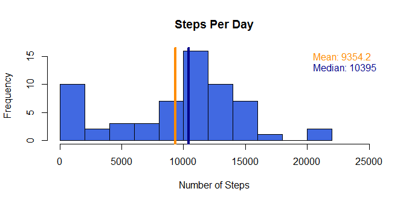
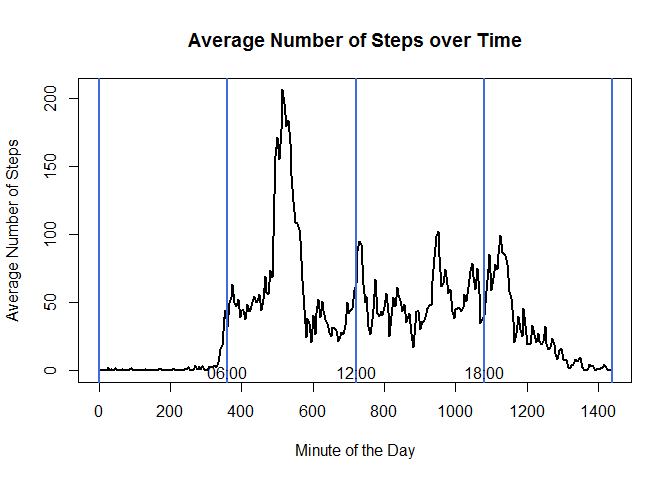
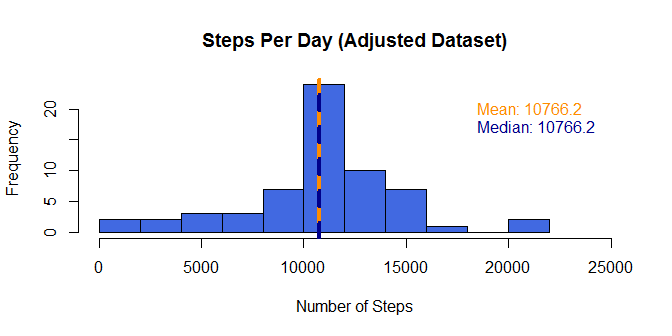

# Reproducible Research: Peer Assessment 1


## Loading and preprocessing the data
The dataset is about personal movement using activity monitoring devices. The devices collect data at 5 minute intervals through out the day. The data consists of two months of data from an anonymous individual collected during the months of October and November, 2012 and include the number of steps taken in 5 minute intervals each day.  
The complete dataset can be downloaded from https://d396qusza40orc.cloudfront.net/repdata%2Fdata%2Factivity.zip  

The variables included in this comma-separated-value (CSV) file are

- **steps**: Number of steps taking in a 5-minute interval (missing values are coded as NA)
- **date**: The date on which the measurement was taken in YYYY-MM-DD format
- **interval**: Identifier for the 5-minute interval in which measurement was taken

At first we load the dataset, convert the **date** column into date format, add the **minute** column and have a look at the number of steps:

```r
unzip("./repdata-data-activity.zip")
activityDataFrame <- read.csv("activity.csv", na.strings = "NA", 
                              stringsAsFactors = FALSE)
activityDataFrame$date <- as.Date(activityDataFrame$date)
activityDataFrame$minute <- rep(seq.int(0,1435,5),61)
summary(activityDataFrame$steps)
```

```
##    Min. 1st Qu.  Median    Mean 3rd Qu.    Max.    NA's 
##    0.00    0.00    0.00   37.38   12.00  806.00    2304
```

There are a lot of NA-Values in the **steps** column.

## What is mean total number of steps taken per day?

Now we have a look at the sum of steps for each day:

```r
library(dplyr)
```


```r
stepsPerDay <- summarize(group_by(activityDataFrame, date), 
          SumSteps = sum(steps, na.rm=TRUE))
hist(stepsPerDay$SumSteps, col = 'royalblue', main = "Steps Per Day",
ylab = "Frequency", xlab = "Number of Steps", breaks = 12, xlim=c(0,25000))
abline(v = mean(stepsPerDay$SumSteps), col = 'darkorange', lwd = 4)
abline(v = median(stepsPerDay$SumSteps), col = 'darkblue', lwd = 4)
text(x = 20000, y = 15, labels = paste("Mean:", round(mean(stepsPerDay$SumSteps),1)),
     pos = 4, col = 'darkorange')
text(x = 20000, y = 13, labels = paste("Median:", round(median(stepsPerDay$SumSteps),1)),
     pos = 4, col = 'darkblue')
```

 

The mean and median total steps per day:

```r
paste("Mean:", round(mean(stepsPerDay$SumSteps),1))
```

```
## [1] "Mean: 9354.2"
```

```r
paste("Median:", round(median(stepsPerDay$SumSteps),1))
```

```
## [1] "Median: 10395"
```

## What is the average daily activity pattern?

Now, we have a look at the average number of steps over a day. The **interval** 
column gives the clock time from 0 (00:00:00) to 2355 (23:55:00), so we use the 
**minute** column instead to avoid a "jump" into the next hour, e.g. from 55 (00:55:00) to 100 (01:00:00).

```r
stepsPerInterval <- summarize(group_by(activityDataFrame, minute), 
          AverageSteps = mean(steps, na.rm=TRUE))
plot(stepsPerInterval$minute, stepsPerInterval$AverageSteps, type = "l",
     main = "Average Number of Steps over Time", xlab = "Minute of the Day",
     ylab = "Average Number of Steps", lwd = 2)
abline(v = 0, col = 'royalblue', lwd = 2)
abline(v = 360, col = 'royalblue', lwd = 2)
abline(v = 720, col = 'royalblue', lwd = 2)
abline(v = 1080, col = 'royalblue', lwd = 2)
abline(v = 1440, col = 'royalblue', lwd = 2)
text(x = 360, y = 10, "06:00", pos = 1, col = 'black')
text(x = 720, y = 10, "12:00", pos = 1, col = 'black')
text(x = 1080, y = 10, "18:00", pos = 1, col = 'black')
```

 

The interval with maximum number of steps on average across all the days:

```r
maxSteps <- stepsPerInterval$AverageSteps[which.max(stepsPerInterval$AverageSteps)]
activityDataFrame$interval[which.max(stepsPerInterval$AverageSteps)]
```

```
## [1] 835
```

Between 8:35 and 8:40 the maximum number of steps (206.17) occur.

## Imputing missing values

Number of rows with missing values:

```r
sum(is.na(activityDataFrame$steps))
```

```
## [1] 2304
```

Strategy for for filling in all of the missing values in the dataset: use
the mean for that 5-minute interval:

```r
meanPerInterval <- summarize(group_by(activityDataFrame, interval), 
          MeanSteps = mean(steps, na.rm=TRUE))
adjustedSteps <- ifelse(is.na(activityDataFrame$steps), 
                     meanPerInterval$MeanSteps[match(activityDataFrame$interval,
                                                     meanPerInterval$interval)], 
                     activityDataFrame$steps)
summary(adjustedSteps)
```

```
##    Min. 1st Qu.  Median    Mean 3rd Qu.    Max. 
##    0.00    0.00    0.00   37.38   27.00  806.00
```

```r
adjustedDataFrame <- activityDataFrame[,2:4]
adjustedDataFrame$steps <- adjustedSteps
anyNA(adjustedDataFrame)
```

```
## [1] FALSE
```
There are no more NA-values in the dataset.  
The distribution of total number of steps with the adjusted dataset:

```r
stepsPerDay <- summarize(group_by(adjustedDataFrame, date), 
          SumSteps = sum(steps, na.rm=TRUE))
hist(stepsPerDay$SumSteps, col = 'royalblue', main = "Steps Per Day (Adjusted Dataset)",
ylab = "Frequency", xlab = "Number of Steps", breaks = 12, xlim=c(0,25000))
abline(v = mean(stepsPerDay$SumSteps), col = 'darkorange', lwd = 4)
abline(v = median(stepsPerDay$SumSteps), col = 'darkblue', lwd = 4, lty = 2)
text(x = 18000, y = 20, labels = paste("Mean:", round(mean(stepsPerDay$SumSteps),1)),
     pos = 4, col = 'darkorange')
text(x = 18000, y = 17, labels = paste("Median:", round(median(stepsPerDay$SumSteps),1)),
     pos = 4, col = 'darkblue')
```

 

The distribution differs from the estimates from the first part of the assignment.   
Impact: Having the adjusted number of steps, mean and median are equal. The distribution looks more like a normal distribution and the number of days with zero steps are much lower.

## Are there differences in activity patterns between weekdays and weekends?

At first we generate an additional column **weekday** (TRUE or FALSE) indicating if the current day is weekday (Monday till Friday) or not.

```r
adjustedDataFrame$weekday <- weekdays(activityDataFrame$date, abbreviate = TRUE) %in%
                             c("Mo", "Di", "Mi", "Do", "Fr")
summary(adjustedDataFrame$weekday)
```

```
##    Mode   FALSE    TRUE    NA's 
## logical    4608   12960       0
```

Now, we have a look at the average number of steps over a day for weekdays and weekend. We use the **interval** column since it was used in the example plot:

```r
stepsPerIntervalWeekday <- summarize(group_by(adjustedDataFrame[adjustedDataFrame$weekday==TRUE,], interval),  AverageSteps = mean(steps, na.rm=TRUE))
stepsPerIntervalWeekend <- summarize(group_by(adjustedDataFrame[adjustedDataFrame$weekday==FALSE,], interval), AverageSteps = mean(steps, na.rm=TRUE))
par(mfrow = c(2,1))
plot(stepsPerIntervalWeekday$interval, stepsPerIntervalWeekday$AverageSteps, 
     type = "l",
     main = "Average Number of Steps over Time (Weekday)", xlab = "Interval",
     ylab = "Average Number of Steps", lwd = 2,
     ylim = c(0, 250))
plot(stepsPerIntervalWeekend$interval, stepsPerIntervalWeekend$AverageSteps, 
     type = "l",
     main = "Average Number of Steps over Time (Weekend)", xlab = "Interval",
     ylab = "Average Number of Steps", lwd = 2,
     ylim = c(0, 250))
```

 

Result: On weekends, the steps are more distributed over the day. At weekdays there is a peak in the morning and only little peaks in the afternoon and in the evening.  
On weekends, steps occur later in the morning than on weekdays (e.g. people sleep longer than on weekdays).
